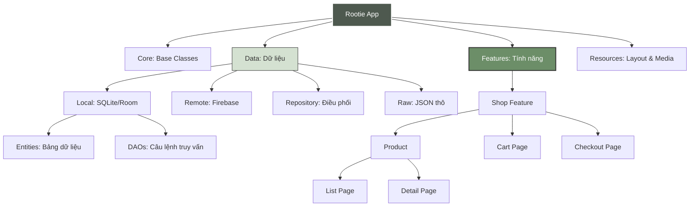

# 🌿 Rootie - Vegan Beauty Application

Chào mừng team đến với dự án Rootie! Đây là ứng dụng thương mại điện tử chuyên về mỹ phẩm thuần chay, được xây dựng trên nền tảng Android (Kotlin/Java) kết hợp với Firebase Firestore.

---

## 🛠 1. Hướng dẫn thiết lập máy mới (Setup)

Để chạy được dự án này từ một máy trống hoàn toàn, các bạn cần thực hiện các bước sau:

1.  **Cài đặt phần mềm:**
    *   **Android Studio:** Phiên bản Ladybug (2024.2.1) hoặc mới hơn.
    *   **JDK:** Java 17 (Cấu hình trong *Settings -> Build, Execution, Deployment -> Build Tools -> Gradle -> Gradle JDK*).
    *   **Python 3.x:** Để chạy script upload dữ liệu lên Firebase.

2.  **Cấu hình Firebase:**
    *   Tải file `google-services.json` từ Firebase Console và bỏ vào thư mục `app/`. --> Đã bỏ vào
    *   Tải file `serviceAccountKey.json` (Key quản trị) và bỏ vào thư mục gốc của dự án (cùng cấp với file `README.md`) để sử dụng script Python.

3.  **Đồng bộ dự án:**
    *   Mở dự án bằng Android Studio.
    *   Nhấn **File -> Sync Project with Gradle Files** và đợi tải các thư viện.

---

## 🏗 2. Cấu trúc thư mục & Quy định Code

Team cần tuân thủ cấu trúc thư mục sau để dự án không bị rối:

*   **`com.veganbeauty.app.core`**: Chứa các lớp cơ sở (BaseFragment, BaseActivity) dùng chung.
*   **`com.veganbeauty.app.data`**:
    *   `local`: Cấu hình Database SQLite (Room).
    *   `remote`: Các dịch vụ kết nối Firebase/API.
    *   `repository`: Nơi kết nối dữ liệu local và remote lại với nhau.
    *   `local/entities/`: Chứa các bản thiết kế dữ liệu (Entity).
    *   `local/dao/`: Chứa các câu lệnh truy vấn dữ liệu (DAO).
*   **`com.veganbeauty.app.features`**: **ĐÂY LÀ NƠI TEAM SẼ CODE TÍNH NĂNG MỚI.**
    *   Chia nhỏ theo chức năng cụ thể:
        *   `shop/product/list/`: Danh sách sản phẩm.
        *   `shop/product/detail/`: Chi tiết sản phẩm.
        *   `shop/cart/`: Giỏ hàng (Tương lai).
    *   Mỗi folder con sẽ chứa: `Fragment`, `Adapter`. `ViewModel` thường đặt ở folder gốc của tính năng.
*   **`res/layout`**: Đặt tên layout theo quy tắc: `tên_tính_năng_loại_file.xml` (Ví dụ: `shop_fragment.xml`, `shop_item_product.xml`).

---

## 🛒 3. Luồng phát triển tính năng (Ví dụ: Tính năng Shop)

Nếu team muốn hiểu trang Sản phẩm (Shop) đã được xây dựng như thế nào, hãy xem thứ tự dưới đây:

### Thứ tự thực hiện:
1.  **Data Layer (Thiết lập dữ liệu):**
    *   `local/entities/ProductEntity.kt`: Định nghĩa cấu trúc sản phẩm (ID, tên, giá, ảnh...).
    *   `local/dao/ProductDao.kt`: Viết các câu lệnh truy vấn dữ liệu (Lấy tất cả, lấy theo ID).
    *   `local/RootieDatabase.kt`: Đăng ký bảng sản phẩm vào hệ thống Room Database.
    *   `repository/ProductRepository.kt`: Lớp trung gian để lấy dữ liệu từ Firebase về lưu vào Local rồi đưa lên UI.

2.  **UI Layer (Giao diện):**
    *   `shop_item_product.xml`: Thiết kế 1 ô sản phẩm lẻ.
    *   `shop_fragment.xml`: Thiết kế danh sách sản phẩm (chứa RecyclerView).
    *   `shop_fragment_detail.xml`: Thiết kế trang chi tiết khi bấm vào sản phẩm.

3.  **Logic Layer (Kết nối):**
    *   `ShopListAdapter.kt`: Lấy `shop_item_product.xml` để đổ dữ liệu từng sản phẩm vào.
    *   `ShopViewModel.kt`: Quản lý logic tải dữ liệu và trạng thái của trang Shop.
    *   `ShopListFragment.kt`: File điều khiển chính, hiển thị danh sách và xử lý Click để chuyển sang trang Chi tiết.

## 🌳 5. Sơ đồ cấu trúc dự án (Project Architecture)



## 🔄 6. Quy trình đồng bộ dữ liệu (Sync Data)

Dự án sử dụng **`app/src/main/assets/`** làm "Nguồn sự thật" (Source of Truth) duy nhất cho toàn bộ dữ liệu:

1.  **Cập nhật dữ liệu gốc:** 
    *   Mở thư mục `app/src/main/assets/`.
    *   Chỉnh sửa file JSON (ví dụ: `products.json`) trực tiếp trong Android Studio.
2.  **Đồng bộ lên Firebase (Cloud):** 
    *   Mở Terminal và chạy lệnh: `python upload_to_firestore.py`.
    *   Script này sẽ lấy dữ liệu từ `assets` đẩy lên Cloud Firestore.
3.  **Đồng bộ vào SQLite (Local):** 
    *   Bấm nút **Run App** (Hình tam giác xanh).
    *   Khi App khởi chạy, nó sẽ tự động đọc file JSON từ `assets` và nạp vào SQLite.

=> **Kết quả:** Dữ liệu trên Cloud và dữ liệu Offline dưới máy luôn khớp nhau 100%.

---

## 🔥 4. Cách cập nhật dữ liệu Firebase nhanh nhất

Nếu bạn muốn thay đổi giá sản phẩm hoặc thêm 100 sản phẩm mới lên Firebase cùng một lúc:

1.  Mở thư mục: `app/src/main/java/com/veganbeauty/app/data/raw/`
2.  Tìm file `products.json` và chỉnh sửa dữ liệu trong đó.
3.  Mở Terminal tại thư mục gốc dự án và chạy lệnh:
    ```bash
    python upload_to_firestore.py
    ```
    *Script này sẽ tự động xóa/cập nhật toàn bộ dữ liệu từ file JSON lên thẳng Firestore trong vài giây.*

---

## ⚠️ Lưu ý cho Team
*   Luôn dùng **View Binding** thay vì `findViewById`.
*   Tất cả logic xử lý dữ liệu phải nằm trong **ViewModel**, không được viết code xử lý nặng trong Fragment.
*   Khi tạo tính năng mới, hãy tạo folder tương ứng trong `features/`.
